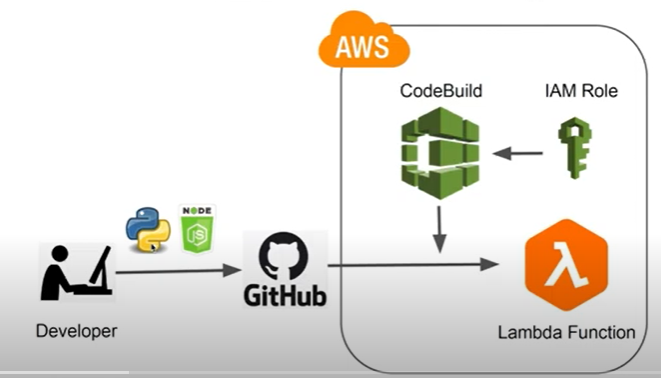

# TASK 2: BACKEND APPLICATION IMPLEMENTATION

This repo contains the the deliverable for a backend solution exposing the requested metrics. It serves the output of the following computations:
- the average monthly value from 1st of June 2022 to 1st of July 2023 metrics for each ADM1 areas of Colombia and Burkina Faso (metric A)
- The daily national estimate for the FCS prevalence from 1st of June 2022 to 1st of July 2023
(metric B) and its variance

The output of the metrics can be seen at the following endpoint: https://byyp3wv7otj6cmoxmksgwz5bze0pocum.lambda-url.eu-central-1.on.aws/

The deployment of the backend is automized and the used CI/CD approch is shown in the above figure

Here is a list of the main files and their usage 
- **lambda_function.py** contains all the necessery code used to compute and deliver the output of the requested metrics
- **iam-policy.json** contains policy to add foir the CodeBuild service
- **buildspec.yml** file will first install the dependencies for the Lambda function code. Then, it will zip up the Lambda function code and deploy it to AWS Lambda.

